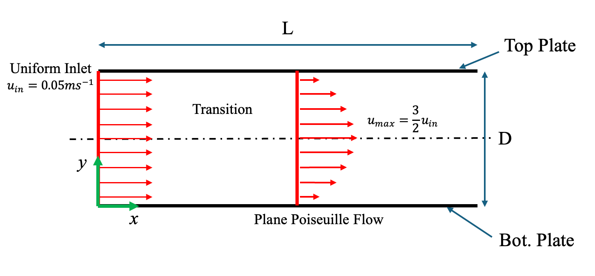
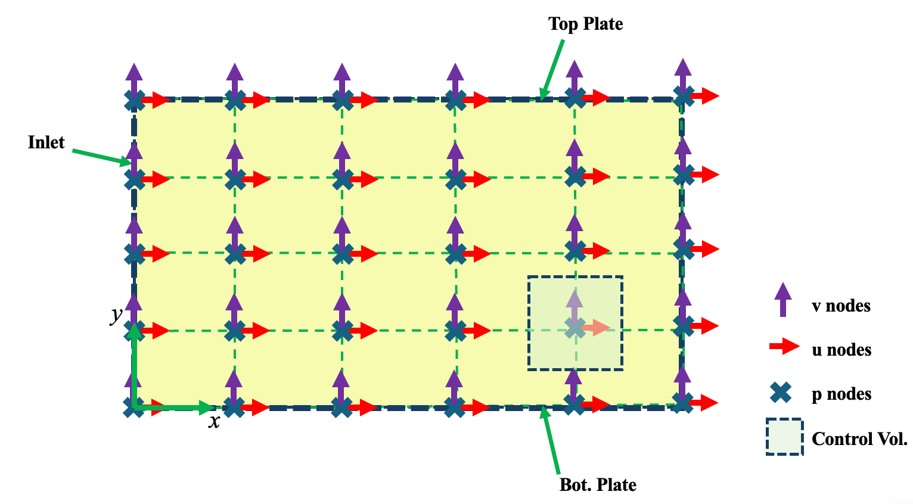
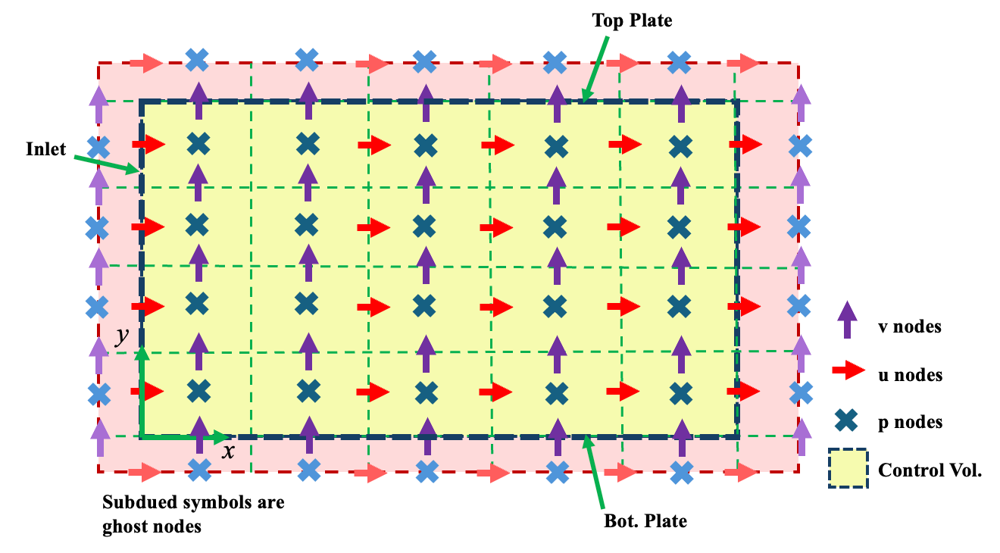
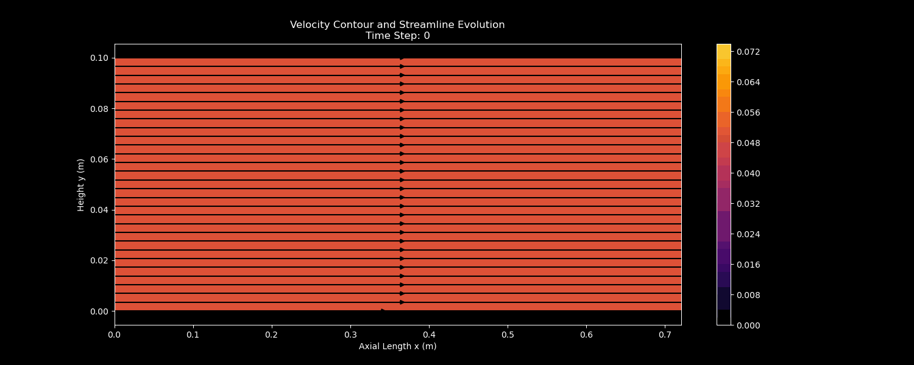
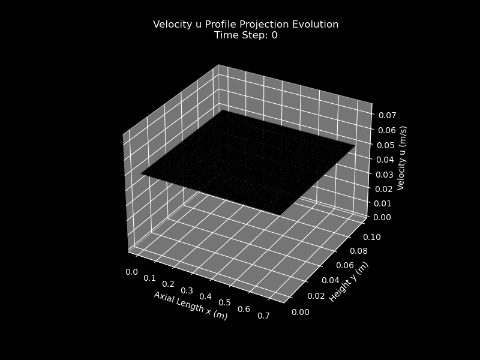
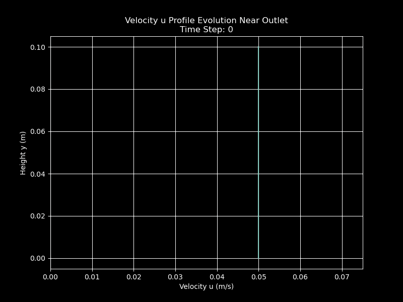
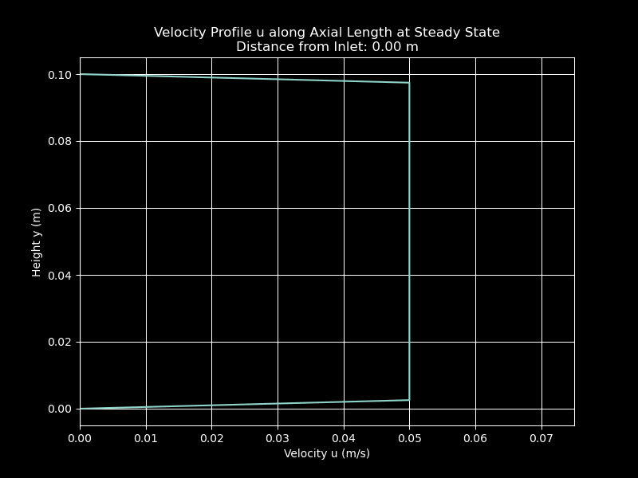
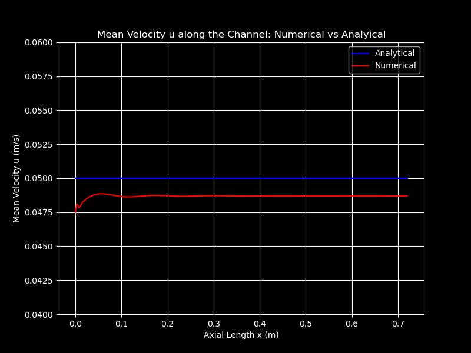
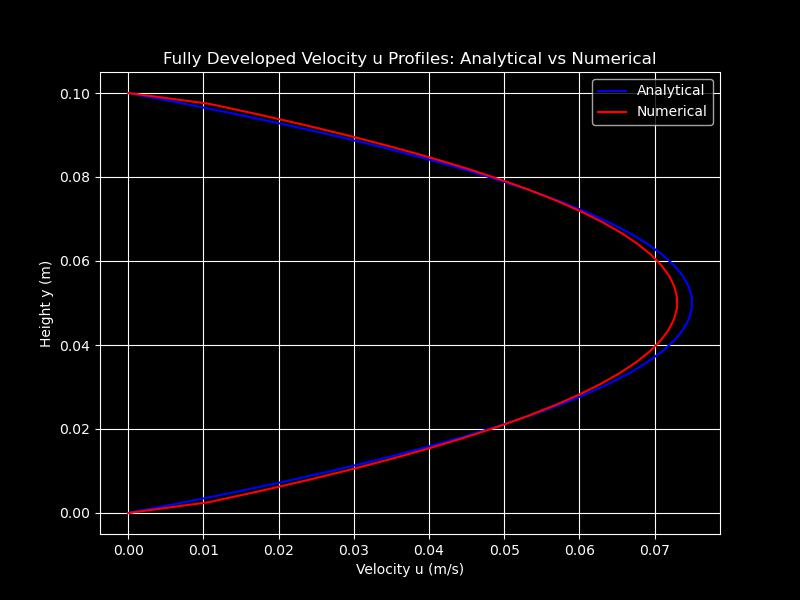

# Plane Poiseuille Flow Simulation for Honey Transport
## Table of Contents
- [0. Attribution Statement](#0-attribution-statement)
- [1. Introduction](#1-introduction)
- [2. Physical Setup](#2-physical-setup)
- [3. Governing Equations](#3-governing-equations)
- [4. Computational Domain](#4-computational-domain)
- [5. Boundary Conditions](#5-boundary-conditions)
- [6. Initial Conditions](#6-initial-conditions)
- [7. Semi-Implicit Solver](#7-semi-implicit-solver)
- [8. Solution Algorithm](#8-solution-algorithm)
- [9. Simulation Setup](#9-simulation-setup)
- [10. Results & Discussion](#10-results-and-discussion)
- [11. Limitations](#11-limitations)
- [12. Potential Improvements & Further Actions](#12-potential-improvements--further-actions)
- [13. References](#13-references)

## 0. Attribution Statement
Parts of the domain setup and implementation structure were adapted from an [open-source reference](https://github.com/Ceyron/machine-learning-and-simulation/blob/main/english/simulation_scripts/pipe_flow_with_inlet_and_outlet_python.py) implemented by Ceyron (2021). The semi-implicit solver, discretisation derivations, and analysis presented here are original to this project. 

## 1. Introduction
### 1.1 Background
This project models the transportation of honey between two parallel plates involved in an industrial honey transport process. The manufacturer transports honey at a bulk velocity of $0.05$ $ms^{-1}$ through a gap of $0.10$ $m$. Throughout the transportation, honey is modelled as a Newtonian fluid, and the flow is expected to remain laminar and incompressible.  

Under these conditions, the honey flow will transition from uniform inlet velocity into a plane Poiseuille velocity profile. Such flow is characterised by a parabolic axial velocity profile driven by a constant pressure gradient, with zero velocity at both walls and a maximum at the channel centreline. 

For plane Poiseuille flow between plates at ```y = 0``` and ```y = D```: 

$$
\begin{align}
u(y) = u_{max}(1 - (\frac{2y}{D} - 1)^2)
\end{align}
$$

, with

$$
\begin{align}
u_{max} = \frac{3}{2}u_{avg}
\end{align}
$$


### 1.2 Objectives
---
The objective of this simulation is to: 
- Numerically model the transient development of channel flow from an initially uniform inlet velocity to a fully developed profile using a semi-implicit CFD solver. 
- Validate the numerical solution reproduces the expected planar Poiseuille flow.

## 2. Physical Setup
### 2.1 Flow Assumptions
---
The following flow assumptions define the physical regime of the model: 
- Newtonian fluid (constant viscosity)
- Incompressible
- Laminar ```(Re < 2000)```
- Uniform plate separation
- Negligible gravity

<p align = center>
<em>Table 1. Physical Setup</em>

| D $(m)$ | ${u_{in}}$ $(ms^{-1})$ |  $\nu$ $(Pa\cdot s)$ | $\rho$ $(kg\cdot m^{-3})$|
|:---:|:---:|:---:|:---:|
|0.1|0.05|0.005|1430|

</p>

--- 

### 2.2 Reynolds Number Verification
---
$$
\begin{align}
\mathbf{Re} = \frac{u_{in}\cdot D}{\nu} = 1
\end{align}
$$


Since:  
$$\mathbf{Re < 2000}$$
, the flow is laminar. 

<p style="text-align: center">
<em>Figure 1. Plane Poiseuille Flow Transition.</em>
</p>

## 3. Governing Equations
The flow is governed by the 2-D incompressible Navier-Stokes Equation: 
- Momentum (x-direction):

$$
\begin{align}
\frac{\partial u}{\partial t} + u\frac{\partial u}{\partial x} + v\frac{\partial u}{\partial y} = \frac{-1}{\rho}\frac{\partial p}{\partial x} + \nu(\frac{\partial^2 u}{\partial x^2} + \frac{\partial^2 u}{\partial y^2})
\end{align}
$$

- Momentum (y-direction):
$$
\begin{align}
\frac{\partial v}{\partial t} + u\frac{\partial v}{\partial x} + v\frac{\partial v}{\partial y} = \frac{-1}{\rho}\frac{\partial p}{\partial y} + \nu(\frac{\partial^2 v}{\partial x^2} + \frac{\partial^2 v}{\partial y^2})
\end{align}
$$
    
- Continuity: 
$$
\begin{align}
\frac{\partial u}{\partial x} + \frac{\partial v}{\partial y} = 0
\end{align}
$$

To enforce incompressibility, Chorin's projection method (Chorin, 1967) is used, requiring the solution of a Pressure Poisson Equation (PPE) at every time step. 

- Pressure Poisson Equation (PPE) 
$$
\begin{align}
\frac{\partial^2 p'}{\partial x^2} + \frac{\partial^2 p'}{\partial y^2} = \frac{\rho}{\Delta t}(\frac{\partial u^*}{\partial x} + \frac{\partial v^*}{\partial y})
\end{align}
$$


### FAQ
---
"What is Chorin's projection?"
- Chorin's projection method decouples velocity and pressure by first solving the momentum equations without enforcing incompressibility, resulting in an intermediate velocity field $u^*$. A pressure correction is then obtained by solving a Poisson equation, and the velocity field is corrected accordingly to satisfy incompressibility. 
- More details on --> [*A Numerical Method for Solving Incompressible Viscous Flow Problems*](https://math.berkeley.edu/~chorin/chorin67.pdf) (Chorin, 1967)

## 4. Computational Domain
A staggered grid was chosen over collocated grids to avoid pressure checkerboarding, required for stable pressure-velocity coupling. 

### FAQ
---
"What is pressure checkerboarding?"
- Pressure checkerboarding is commonly observed in collocated grid arrangements, where pressure values decouple from velocity, producing non-physical oscillatory pressure fields. Using a staggered grid ensures that pressure and velocity gradients are naturally coupled to stabilise the simulation. 

***Important Note***
- On a staggered grid, there are no universal spatial nodes; each variable is stored at the centre of its own control volume. 

<p style="text-align: center">
<em>Figure 2. Collocated Grid Domain.</em>
</p>

<p style="text-align: center">
<em>Figure 3. Staggered Grid Domain.</em>
</p>

## 5. Boundary Conditions
<p align = center>
<em>Table 2. Bounbdary Conditions. </em>

|Boundary|Type|Description|
|:---:|:---:|:---:|
|Plate (Top & Bot.)|Dirichlet|No-slip condition: $u = v = 0$|
|Inlet|Dirichlet|Uniform axial velocity $u = 0.05$ $ms^{-1}$|
|Outlet|Neumann|Fully developed flow: $\frac{\partial{u}}{\partial{x}}=0$|
|All boundaries|Neumann|Zero normal pressure gradient at all boundaries: $\frac{\partial{p}}{\partial{x}}=\frac{\partial{p}}{\partial{y}}=0$|

</p>

Note: Ghost cells are used to impose wall boundary conditions. 


## 6. Initial Conditions
At $t = 0: $
- $u = 0.05$ $ms^{-1}$
- $v = 0$
- $p = 0$

## 7. Semi-Implicit Solver
The 2-D incompressible Navier-Stokes equations are discretised using the finite difference method on a staggered grid and solved using a semi-implicit approach. 

### 7.1 Discretization of Momentum Equation
---
To avoid unnecessary repetition, only the discretisation of the u-momentum equation is presented in detail. The v-momentum equation is discretised following the same treatment. 
#### 7.1.1 Momentum & Diffusion
---
The Momentum term is discretized as: 
$$
\begin{align}
MOM_u=\frac{\partial{u}}{\partial{t}} ≈ \frac{u_{i,j}^{n+1} - u_{i,j}^{n}}{\Delta t}
\end{align}
$$
Note: This time derivative is independent of grid staggering and therefore is evaluated at the same node as the velocity. 

The Diffusion term is discretized as: 

$$
\begin{align}
DIF_u = \nu (\frac{\partial^2{u}}{\partial{x^2}} + \frac{\partial^2{u}}{\partial{y^2}}) ≈ \frac{\nu}{h^2} \cdot (u_{i+1,j}^{n+1}+u_{i-1,j}^{n+1}+u_{i,j + 1}^{n+1}+u_{i,j - 1}^{n+1}-4u_{i,j}^{n+1})
\end{align}
$$

#### 7.1.2 Advection
---
By chain rule: 
$$
\begin{align}
ADV_u=u\frac{\partial u}{\partial x} + v\frac{\partial u}{\partial y} = \frac{1}{2}\frac{\partial u^2}{\partial x} + v\frac{\partial u}{\partial y}
\end{align}
$$

Hence, the Advection term is discretized as: 

$$
\begin{align}
ADV_u ≈ \frac{1}{2} \cdot \frac{(u_{i+1,j}^{n})^2 - (u_{i-1,j}^{n})^2}{2h} + \frac{1}{4} \cdot (v_{i,j}^{n} + v_{i,j + 1}^{n} + v_
{i + 1,j}^{n} + v_{i + 1,j + 1}^{n})\cdot \frac{u_{i,j + 1}^{n} - u_{i,j-1}^{n}}{2h}
\end{align}
$$

Tidying up: 

$$
\begin{align}
ADV_u ≈ \frac{1}{4h}((u_{i+1,j}^{n})^2 - (u_{i - 1,j}^{n})^2) + \frac{1}{8h} \cdot (v_{i,j}^{n} + v_{i,j + 1}^{n} + v_
{i + 1,j}^{n} + v_{i + 1,j + 1}^{n})\cdot (u_{i,j + 1}^{n} - u_{i,j-1}^{n})
\end{align}
$$

##### FAQ
---
"The indices look weird...Isn't the control volume centred at spatial or pressure nodes?"
- On a staggered grid, each variable has its own control volume. There is not a single universal control volume. 
- When writing the u-momentum equation, the u-control volume is used.
- u-control volume is stored at $u_{i+\frac{1}{2},j}$, which is a fixed point in space and the centre of the u-control volume that spans: 
  - from $x_i$ to $x_{i+1}$
  - from $y_{j-\frac{1}{2}}$ to $y_{j+\frac{1}{2}}$

"Why is v averaged?"
- v is linearly interpolated to the u node of interest (see figure?). 


#### 7.1.3 Pressure Gradient
---
The Pressure Gradient term is discretized as: 

$$
\begin{align}
PG_u=\frac{\partial{p}}{\partial{x}} ≈ \frac{p_{i+1,j}^{n} - p_{i,j}^{n}}{h}
\end{align}
$$

Note: evaluated at the u node of interest.

#### 7.1.4 Full Equation
---
Combining all terms: 
$$
\begin{align}
MOM_u + ADV_u=PG_u+DIF_u
\end{align}
$$

$$
\begin{align}
\frac{u_{i,j}^{n+1} - u_{i,j}^{n}}{\Delta t} + \frac{1}{4h}((u_{i+1,j}^{n})^2 - (u_{i - 1,j}^{n})^2) + \frac{1}{8h} \cdot (v_{i,j}^{n} + v_{i,j + 1}^{n} + v_{i + 1,j}^{n} + v_{i + 1,j + 1}^{n})\cdot (u_{i,j + 1}^{n} - u_{i,j-1}^{n}) = \frac{-1}{\rho} (\frac{p_{i+1,j}^{n} - p_{i,j}^{n}}{h}) + \frac{\nu}{h^2} \cdot (u_{i+1,j}^{n+1}+u_{i-1,j}^{n+1}+u_{i,j+1}^{n+1}+u_{i,j-1}^{n+1}-4u_{i,j}^{n+1})
\end{align}
$$

Separating time step $n + 1$ and $n$ terms:
$$
\begin{align}
u_{i,j}^{n+1} \cdot (1 + \frac{4\nu \Delta t}{h^2}) - \frac{\nu \Delta t}{h^2} \cdot (u_{i+1,j}^{n+1}+u_{i-1,j}^{n+1}+u_{i,j+1}^{n+1}+u_{i,j-1}^{n+1}) = u_{i,j}^n - \frac{\Delta t}{\rho h} (p_{i+1,j}^{n} - p_{i,j}^{n}) -\frac{\Delta t}{4h}((u_{i+1,j}^{n})^2 - (u_{i - 1,j}^{n})^2) - \frac{1}{8h} \cdot (v_{i,j}^{n} + v_{i,j + 1}^{n} + v_{i + 1,j}^{n} + v_{i + 1,j + 1}^{n})\cdot (u_{i,j + 1}^{n} - u_{i,j-1}^{n})
\end{align}
$$

This forms a system of linear equation which can be expressed using: 
$$
\begin{align}
\mathbf{A_u \cdot B_u^{n+1} = C_u^{n}}
\end{align}
$$

, where <br>
$\mathbf{A_u} =$ Sparse matrix, <br>
$\mathbf{B_u^{n+1}} =$ Unknown u at the next time step, and <br>
$\mathbf{C_u^n} =$ Known u at the current time step. 

#### 7.2.1 Example Matrix
---
For a domain with $N_x$ and $N_y$ spatial nodes: 
$$\mathbf{A_u} \in \mathbb{R}^{(Ny-1)(Nx - 2) \times (Ny - 1)(Nx - 2)} $$
$$\mathbf{A_u} = 
\begin{align}
\begin{bmatrix}
D & a & 0 & a & 0 & 0 & 0 & 0 & ...\\
a & D & a & 0 & a & 0 & 0 & 0 & ...\\
0 & a & D & a & 0 & a & 0 & 0 & ...\\
0 & 0 & a & D & a & 0 & a & 0 & ...\\
0 & 0 & 0 & a & D & a & 0 & a & ...\\
0 & 0 & 0 & 0 & a & D & a & 0 & ...\\
0 & 0 & 0 & 0 & 0 & a & D & a & ...\\
0 & 0 & 0 & 0 & a & 0 & a & D & ...\\
... & ... & ... & ... & ... & ... & ... & ... & ... & 
\end{bmatrix}
\end{align}$$


, where<br>
$a = -\frac{\nu \Delta t}{h^2}$, and<br>
$D = 1 - 4a$.


$$\mathbf{B_u^{n+1}} \in \mathbb{R}^{(Ny-1)(Nx-2)}$$

$$
\begin{align}
\mathbf{B_u^{n+1}} = 
\begin{pmatrix}
u_{1,1}^{n+1}\cr u_{1,2}^{n+1}\cr u_{1,3}^{n+1}\cr u_{1,4}^{n+1} \cr ... \cr u_{1,Ny - 1}^{n+1} \cr 
u_{2,1}^{n+1}\cr u_{2,2}^{n+1}\cr u_{2,3}^{n+1}\cr u_{2,4}^{n+1} \cr ... \cr u_{Nx - 2,Ny - 1}^{n+1}
\end{pmatrix}
\end{align}
$$

$$
\begin{align}
\mathbf{C_u^{n}} = 
\begin{pmatrix}
-\Delta t \cdot ADV_u + \Delta t \cdot PG_u + u_{1,1}^{n}\cr-\Delta t \cdot ADV_u + \Delta t \cdot PG_u + u_{1,2}^{n}\cr -\Delta t \cdot ADV_u + \Delta t \cdot PG_u + u_{1,3}^{n}\cr -\Delta t \cdot ADV_u + \Delta t \cdot PG_u + u_{1,4}^{n} \cr ... \cr -\Delta t \cdot ADV_u + \Delta t \cdot PG_u + u_{1,Ny - 1}^{n} \cr -\Delta t \cdot ADV_u + \Delta t \cdot PG_u + u_{2,1}^{n}\cr -\Delta t \cdot ADV_u + \Delta t \cdot PG_u + u_{2,2}^{n}\cr -\Delta t \cdot ADV_u + \Delta t \cdot PG_u + u_{2,3}^{n}\cr -\Delta t \cdot ADV_u + \Delta t \cdot PG_u + u_{2,4}^{n} \cr ... \cr -\Delta t \cdot ADV_u + \Delta t \cdot PG_u + u_{Nx - 2,Ny - 1}^{n}
\end{pmatrix}
\end{align}
$$


### 7.2 Discretization of Pressure Poisson Equation PPE
---
PPE is discretized as: 

$$

\frac{\partial^2 p'}{\partial x^2} + \frac{\partial^2 p'}{\partial y^2} ≈ 
\frac{1}{h^2}(p'_{i+1,j} - 2p'_{i,j} + p'_{i-1,j}) + \frac{1}{h^2}(p'_{i,j-1} - 2p'_{i,j} + p'_{i,j + 1})

$$

Tidying up: 
$$
\begin{align}
\frac{\partial^2 p'}{\partial x^2} + \frac{\partial^2 p'}{\partial y^2} ≈ 
\frac{1}{h^2}(p'_{i+1,j} + p'_{i-1,j} + p'_{i,j+1} + p'_{i,j - 1} - 4p'_{i,j})
\end{align}
$$

Continuity: 
$$
\frac{\partial u^*}{\partial x} + \frac{\partial v^*}{\partial y} ≈ \frac{1}{h} (u_{i+1,j}^{* n+1} - u_{i,j}^{* n+1}) + \frac{1}{h} (v_{i,j+1}^{* n+1} - v_{i,j}^{* n+1})
$$
, which gives:
$$
\begin{align}
\frac{\partial u^*}{\partial x} + \frac{\partial v^*}{\partial y} ≈ \frac{1}{h} (u_{i+1,j}^{* n+1} - u_{i,j}^{* n+1} + v_{i,j+1}^{* n+1} - v_{i,j}^{* n+1})
\end{align}
$$

Combining both sides: 
$$
\begin{align}
\frac{1}{h^2}(p'_{i+1,j} + p'_{i-1,j} + p'_{i,j+1} + p'_{i,j - 1} - 4p'_{i,j}) =\frac{\rho}{\Delta t \cdot h}(u_{i+1,j}^{* n+1} - u_{i,j}^{* n+1} + v_{i,j+1}^{* n+1} - v_{i,j}^{* n+1})
\end{align}
$$

Rearrange for Jacobi iteration: 
$$
\begin{align}
p'_{i,j} = \frac{1}{4}(p'_{i+1,j} + p'_{i-1,j} + p'_{i,j+1} + p'_{i,j-1} - \frac{\rho h }{\Delta t}(u_{i+1,j}^{* n+1} - u_{i,j}^{* n+1} + v_{i,j+1}^{* n+1} - v_{i,j}^{* n+1}))
\end{align}
$$

Updating Pressure: 
$$
\begin{align}
p_{cor(i, j)} = p_{i,j} + p'_{i,j}
\end{align}
$$
, where: <br>
$p_{cor}$ denotes the corrected pressure field, <br>
$p$ is the pressure field before correction, and <br>
$p'$ is the pressure correction term.

#### FAQ
---
"What does p', u* and v* stand for?"
- p' is the pressure correction term, introduced to enforce mass conservation.
- The asterisks on the velocity components denote the intermediate velocity obtained after solving the momentum equation but without enforcing incompressibility. As a result, u* does not, generally, satisfy the divergence-free velocity field. <br>

"Why is the time step ommitted for p'?"
- Because pressure correction is not a time-dependent variable (There is no time derivative of p' anywhere). It is a correction field solved inside a time step. 


## 8. Solution Algorithm
1. Initialise domain, velocity, and pressure fields.
1. Apply boundary conditions.
1. Compute advection terms explicitly.
1. Solve implicit diffusion for intermediate velocities $u^*, v^*$.
1. Compute divergence and solve PPE with Jacobi iterative method.
1. Correct velocities with pressure gradient; re-apply boundary conditions.
1. Check divergence; repeat inner loop until below tolerance. 
1. Advance time step
1. Repeat until steady state is reached


## 9. Simulation Setup

<p align = center>
<em> Table 3. Simulation Parameters</em>

|$Nx$|$Ny$|$h$ $(m)$|$Nt$|$\Delta t$ $(s)$|$tol$| ${u_{in}}$ $(ms^{-1})$ |  $\nu$ $(Pa\cdot s)$ | $\rho$ $(kg\cdot m^{-3})$|
|:---:|:---:|:---:|:---:|:---:|:---:|:---:|:---:|:---:|
|313|40|0.0026|160|0.001|0.01|0.05|0.005|1430|

</p>

### 9.1 CFL Stability Check
---
Since
$$\frac{u_{max} \Delta t}{h} = 0.029 \leq 1 $$
, the Courant condition is satisfied. 

This condition ensures the stability of the explicit advection discretisation. 

## 10. Results & Discussion
### 10.1 Plots
---
<p style="text-align: center">
<em>Figure 4. Velocity Contour and Streamline Evolution.</em>
</p>
<p style="text-align: center">
<em>Figure 5. Velocity u Profile Projection Evolution</em>
</p>
<p style="text-align: center">
<em>Figure 6. Velocity u Profile Evolution Near Outlet</em>
</p>
</p>
<p style="text-align: center">
<em>Figure 7. Velocity Profile u along Axial Length at Steady State</em>
</p>
<p style="text-align: center">
<em>Figure 8. Steady State Velocity Vector Plot.</em>
</p>
<p style="text-align: center">
<em>Figure 9. Mean Velocity u along the Channel Comparison.</em>
</p>
<p style="text-align: center">
<em>Figure 10. Fully Developed Velocity u Profiles Comparison.</em>
</p>

### 10.2 Discussion
---
- Figures 5, 6, 7, 8, and 10 demonstrate that the numerical solution converges
to the expected plane Poiseuille flow profile. The axial velocity forms a parabolic profile across the channel height, with zero velocity at both walls due to the no-slip boundary condition and a maximum at the
channel centreline. This behaviour is consistent with the analytical solution for fully developed laminar flow between parallel plates. 

- As shown in Figures 7 and 8, the flow enters the domain with a uniform velocity profile and rapidly transitions downstream into a parabolic distribution. This development occurs because viscous diffusion redistributes
momentum from freestream towards the walls. 

- Figure 9 shows the numerical method obtained mean axial velocity is $u_avg ≈ 0.049$ $ms^{-1}$, compared to the theoretical value of $0.050$ $ms^{-1}$, corresponding to a relative error of 2%. 
- A slight reduction in velocity is observed near the inlet region. 
  - Such behaviour is attributed to residual divergence in the velocity field, as the PPE is solved to a finite tolerance $(tol = 0.01)$. The inlet velocity dip is also affected by the imposition of no-slip condition at the channel walls. 

- Comparison between numerical and analytical velocity profiles in Figure 10 shows excellent agreement in profile shape. The numerically predicted maximum velocity is $u_max ≈ 0.072$ $ms^{-1}$, slightly below the theoretical value of $0.075$ $ms^{-1}$, corresponding to a 4% error. 
- This discrepancy is consistent with the observed reduction in flow rate and is again attributed to incomplete enforcement of the divergence-free constraint resulting from the finite convergence tolerance of the pressure correction step. 

Overall, the results confirmed that the semi-implicit solver successfully reproduces the key characteristics of plane Poiseuille flow, with small quantitative deviations that are well understood. 

## 11. Limitations
- The spatial resolution is limited to $N_y = 40$, which may be insufficient to fully resolve steep velocity gradients within the thin boundary layers. Some fine-scale viscous effects close to the plates may not be accurately captured. 
- The PPE is solved to a finite convergence tolerance as mentioned, resulting in a small but persistent residual divergence in the velocity field. Consequently, the flow is not strictly incompressible, leading to a slight reduction in the predicted flow rate compared to the analytical solution.  

## 12. Potential Improvements & Further Actions
- Convergence of the PPE may be significantly improved by replacing the Jacobi iteration scheme with a Gauss-Seidel scheme, which typically achieve faster convergence at lower computational cost. Alternatively, sparse linear solvers could be employed to enforce incompressibility more accurately, subject to available computational requirements. 
- Spatial accuracy near the channel walls could be enhanced through grid refinement. In addition, adaptive time-stepping based on CFL and diffusion stability constraints could improve numerical efficiency. 
- Finally, the current 2-D simulation could be extended to 3-D or axis-symmetric cylindrical coordinates to model pipe flows. 

## 13. References
1. Ceyron (2021). *pipe_flow_with_inlet_and_outlet_python.py*. GitHub repository: machine-learning-and-simulation. Accessed: 2025-12-19. 
https://github.com/Ceyron/machine-learning-and-simulation/blob/main/english/simulation_scripts/pipe_flow_with_inlet_and_outlet_python.py 

1. Chorin, A. J. (1967). *The numerical solution of the Navier–Stokes equations for an incompressible fluid*.
   Bulletin of the American Mathematical Society, 73(6), 928–931.
   https://doi.org/10.1090/S0002-9904-1967-11853-6
